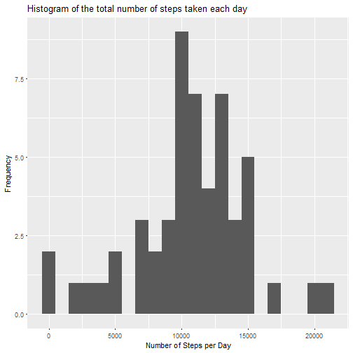
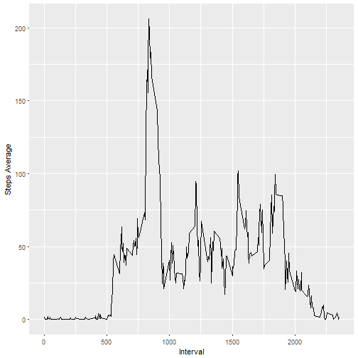
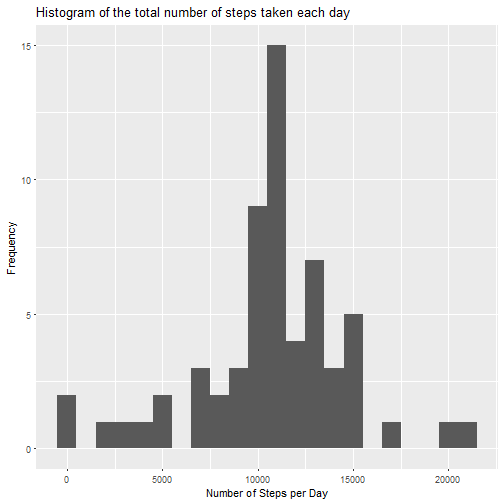
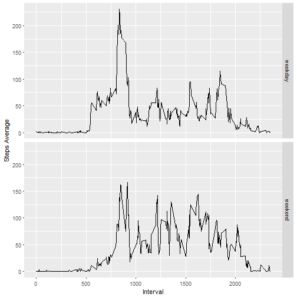

# Reproducible Research: Peer Assessment 1

## Loading libraries

```r
library(dplyr)  
library(ggplot2)
```

## Loading and preprocessing the data

### 1. Load the data (i.e. *read.csv()*)

```r
unzip("repdata%2Fdata%2Factivity.zip")  
activity<-read.csv("activity.csv")  
```

## What is mean total number of steps taken per day?


```r
activity_complete<-activity[complete.cases(activity),]  
```
### 1. Calculate the total number of steps taken per day 


```r
bydate<-group_by(activity_complete,date)
step_day<-summarise(bydate,steps=sum(steps))
```

### 2. Make a histogram of the total number of steps taken each day


```r
qplot(step_day$steps, xlab="Number of Steps per Day", ylab="Frequency", main= "Histogram of the total number of steps taken each day", binwidth=1000)
```



### 3. Calculate and report the mean and median total number of steps taken per day

* Mean: 1.0766189 &times; 10<sup>4</sup>
* Median:  10765

## What is the average daily activity pattern?

```r
byinterval<-group_by(activity_complete, interval)
step_interval<-summarise(byinterval, steps=mean(steps))
```

### 1. Make a time series plot (i.e. *type="l"*) of the 5-minute interval (*x-axis*) and the average number of steps taken, averaged across all days (*y-axis*)


```r
ggplot(step_interval, aes(interval, steps)) + geom_line() + xlab("Interval") + ylab("Steps Average")
```



### 2. Which 5-minute interval, on average across all the days in the dataset, contains the maximum number of steps?

* Maximum Steps Interval: 835

## Imputing missing values

### 1. Calculate and report the total number of missing values in the dataset 

* Number of missing values: 2304

### 2. Devise a strategy for filling in all of the missing values in the dataset.


```r
activity_full<-merge(activity, step_interval, by="interval")
activity_full$steps.x[is.na(activity_full$steps.x)]=as.integer(round(activity_full$steps.y[is.na(activity_full$steps.x)]))
```

### 3. Create a new dataset that is equal to the original dataset but with the missing data filled in.


```r
activity_full<-activity_full[,1:3]
activity_full<-activity_full[,c(2,3,1)]
activity_full<-activity_full[order(activity_full$date),]
activity_full<-rename(activity_full, steps=steps.x)
```

### 4. Make a histogram of the total number of steps taken each day 


```r
bydate_full<-group_by(activity_full,date)
step_day_full<-summarise(bydate_full,steps=sum(steps))
qplot(step_day_full$steps, xlab="Number of Steps per Day", ylab="Frequency", main= "Histogram of the total number of steps taken each day", binwidth=1000)
```



### Calculate and report the mean and median total number of steps taken per day

* Mean: 1.0765639 &times; 10<sup>4</sup>
* Median:  10762

## Are there differences in activity patterns between weekdays and weekends?

### 1. Create a new factor variable in the dataset with two levels - "weekday" and "weekend" indicating whether a given date is a weekday or weekend day.


```r
activity_weekdays<-activity_full
k<-0
for(i in 1:nrow(activity_weekdays)){
  k<-k+1
  if (weekdays(as.Date(activity_weekdays[k,2]))=="Saturday" | weekdays(as.Date(activity_weekdays[k,2]))=="Sunday")
    activity_weekdays$day[k]<-"weekend"
  else
    activity_weekdays$day[k]<-"weekday"
}
activity_weekdays$day<-as.factor(activity_weekdays$day)
```

### 2. Make a panel plot containing a time series plot (i.e. *type="l"*) of the 5-minute interval (*x-axis*) and the average number of steps taken, averaged across all weekday days or weekend days (*y-axis*).


```r
byinterval_weekdays<-group_by(activity_weekdays, interval,day)
step_interval_weekdays<-summarise(byinterval_weekdays, steps=mean(steps))
graph<-ggplot(step_interval_weekdays, aes(interval, steps, group=day)) + geom_line() + xlab("Interval") + ylab("Steps Average")
graph+facet_grid(day~.)
```


